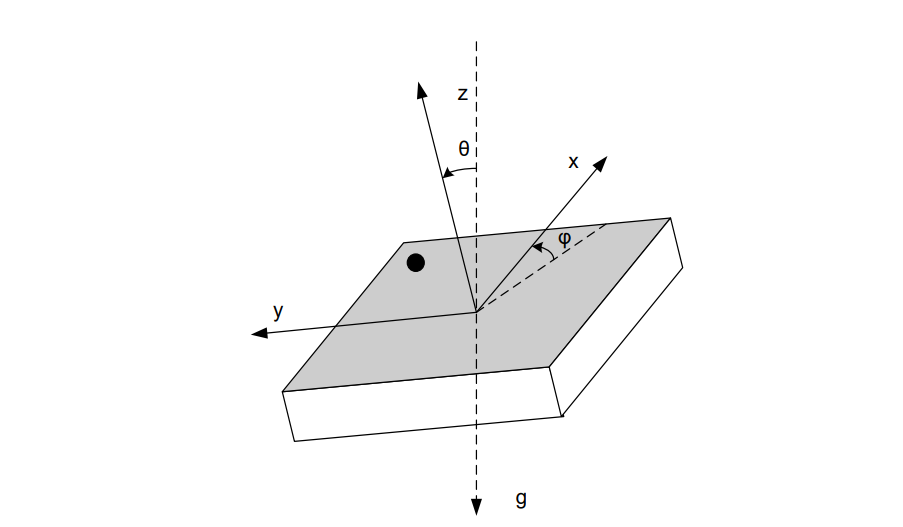

# BMI160 - inertial measurement unit 

The small, low power BMI160 is a low noise 16-bit IMU designed for mobile applications such as AR or indoor navigation, providing highly accurate sensor data and real-time sensor data. 

This class only supports I2C. All operations for a current usage has been developed. The individual interruption level settings for each sensor has not been implemented. If needed, they are quite straight forward to implement.

## Documentation



BMI160 [datasheet](https://www.bosch-sensortec.com/media/boschsensortec/downloads/datasheets/bst-bmi160-ds000.pdf)

You will find this device as ["Inertial Measurement Unit"](https://www.bosch-sensortec.com/products/motion-sensors/imus/bmi160/) or ["BMI1600 Small Low Power IMU"](https://www.sparkfun.com/products/18794)

## Usage

Create a ```Bmi160Sensor``` class and pass the I2C device . The default I2C address is provided in the class.

```csharp
I2cDevice i2cDevice = I2cDevice.Create(new I2cConnectionSettings(1, Bmi160Sensor.DefaultI2cAddress));
Bmi160Sensor bmi160Sensor = new Bmi160Sensor(i2cDevice);
Console.WriteLine($"Id: {bmi160Sensor.Info.ChipId}, AccId: {bmi160Sensor.Info.AcceleratorId}, GyroId: {bmi160Sensor.Info.GyroscopeId}");
Console.WriteLine($"Firmware version: {bmi160Sensor.Info.FirmwareVersion}, Bootloader: {bmi160Sensor.Info.BootloaderVersion}");
Console.WriteLine($"Temperature source: {bmi160Sensor.TemperatureSource}, Operation mode: {bmi160Sensor.OperationMode}, Units: {bmi160Sensor.Units}");
Console.WriteLine($"Powermode: {bmi160Sensor.PowerMode}");
```

You can easily access the sensor information and settings thru the properties.

## Accessing sensor data

Simply access the various sensor data thru their properties. Note that it is better to read at once the data and then display them, or manipulate them rather than accessing the sub element every time. The reason is because in the first case, you'll do 1 measurement and the data will be consistent, in the second case, you'll do 1 measurement every time you access 1 sub property which means, the data will be inconsistent.


The sensor offers 6-axis measurement. Here is an example showing all the sensor properties you can access:

```csharp
while(!Console.KeyAvailable)
{
    Console.Clear();
    var gyro = bmi160Sensor.Gyroscope;
    Console.WriteLine($"Gyroscope X: {gyro.X} Y: {gyro.Y} Z: {gyro.Z}");
    var accele = bmi160Sensor.Accelerometer;
    Console.WriteLine($"Acceleration X: {accele.X} Y: {accele.Y} Z: {accele.Z}");
    var temp = bmi160Sensor.Temperature.Celsius;
    Console.WriteLine($"Temperature: {temp} °C");
    Thread.Sleep(100);
}
```
